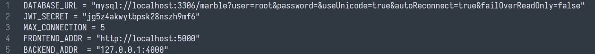
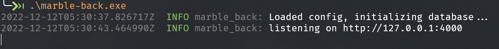
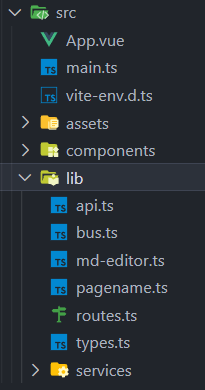
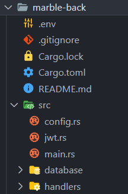

# README

本项目以前后端分离的方式实现了一个简易的个人博客，支持以 Markdown 格式编写和发布文章，对文章进行增添、删除、修改等操作。

## 使用指南

1. 首先准备数据库环境：

    ```shell
    mysql # 启动 mysql
    create database marble; # 创建 marble 数据库
    use marble; # 使用 marble 数据库
    source ./marble.sql # 从外部脚本导入数据
    ```

2. 编辑后端目录中的 `.env` 文件

    

    文件中有 5 个配置可供修改，分别是：

    1. 数据库连接地址：`DATABASE_URL`。一般而言，数据库默认端口都是 3306。可能需要将 user 和 password 字段修改为您所使用的用户
    2. JWT 加密的盐：`JWT_SECRET`。可以不用修改
    3. 数据库最大连接数：`MAX_CONNECTION`。可以不用修改
    4. 前端 URL：`FRONT_ADDR`。这里前端运行在本地 5000 端口上。如需修改，则需要配合前端一起修改，具体见下。
    5. 后端 URL：`BACKEND_ADDR`。这里后端运行在本地 4000 端口上。如需修改，则需要配合前端一起修改，具体见下。

3. 在后端目录运行 `cargo run --release`。看到如下输出代表后端成功启动：

    

4. 接下来运行前端：

    ```shell
    npm install
    npm run dev
    ```

5. 现在，可以在浏览器打开 localhost:5000 进行使用。博客首页有详细的使用说明书。

## 设计过程

### 前端

前端部分采用 Vue 框架，其源代码在 `Marble/marble-front` 中。

其中 `src/App.vue` 和 `src/main.ts` 是整个应用的入口。

在 `src/components` 文件夹下封装了使用的组件。如下。


Footer.vue 作为页脚。Navigator.vue 作为导航栏。Page.vue 则是首页、关于、友链页的一个通用模板。

MainBody 文件夹中的 About.vue 代表「关于」页、Friends.vue 代表「友链」页、Home.vue 代表「主页」、Friends.vue 代表「友链」页、Post.vue 是具体的文章页的模板、PostList.vue 代表「文章」页展示文章列表、Publish.vue 代表「发布」页。

项目主要使用的语言是 TypeScript，相比 JavaScript，它具有强类型的限制，帮助减少项目的 bug。`src/lib` 中包含一些 typescript 代码。



自定义的类型在 `src/lib/types.ts` 中。

应用采用 vue-router（代码在 `src/lib/routes.ts` 中）在多个页面之间导航。

文章支持使用 Markdown 编辑，这是利用了 md-Editor-v3 这个依赖（代码在 `src/lib/md-editor.ts`）。

为了在多个组件之间共享状态，本项目主要使用了 Vue 提供的 `provide` 和 `inject` 函数进行依赖注入，如 markdown 编辑器的状态和用户 jwt 的存储都采用了该方法。另一方面，也使用 `mitt` 包提供的 eventbus（代码在 `src/lib/bus.ts`），在组件之间传递事件的发生，主要用于切换日间模式和夜间模式的主题。

前后端之间的通信，即 http api 请求主要通过 axios 包完成，代码在 `src/lib/api.ts` 和 `src/lib/services` 中。

用户的验证采取 Jwt 方案，相比传统的 Session 方案，它更加轻量化与简单。在发送请求时，需要将 Jwt 附加到请求的请求头中。

至于具体的 http api，在后端项目 `Marble/marble-back/README.md` 中有具体罗列。

项目的 UI 主要使用了 element-plus 包，它提供了成熟稳定的 UI 组件。

`src/assets` 目录包含一些资源，包括图片和 CSS 等。一些全局的 CSS 在 `src/assets/style.css` 中指定，而 `src/assets/variable.css` 则使用 CSS3 的变量功能对样式进行配置。

### 后端

后端使用 Rust 语言完成，主要框架为 Axum。Rust 是一门新兴的强调性能和安全性的语言。源代码在 `Marble/marble-back` 中。目录结构如下：



`.env` 用于进行后端的配置。`Cargo.toml` 和 `Cargo.lock` 描述项目名、项目依赖等等。README.md 中有关于后端的说明，同时也罗列了所有使用的 API 和请求格式。

`src/main.rs` 是后端程序的入口，它会启动服务，初始化数据库连接，并在指定的端口上监听请求。同时其中启用了日志功能。

`src/jwt.rs` 是对 jsonwebtoken 包的封装，包含了创建 jwt、验证 jwt 等。`src/config.rs` 用于读入 `.env` 中指定的配置。

`src/database` 目录下包含和数据库的交互，包含增删改查等。本项目目前只支持 MySQL 数据库。

`src/handlers` 则包含对每个 API 请求进行处理的 handler，这些 handler 在 `src/main.rs` 中注册，在接收请求时由 Axum 路由到相应的 handler 进行处理。

## QA

1. Q：如果 `.env` 找不到怎么办？

    A：这种情况一般是被操作系统当做隐藏文件了。Windows 可以在「文件夹选项」-「查看」中勾选「显示隐藏的文件、文件夹和驱动器」

2. Q：运行后显示无法连接数据库，或者半天没有反应怎么办？

    A：首先检查 `.env` 中的 `DATABSE_URL` 是否正确。然后可以试试在新的终端中运行 `mysqld` 以启动 mysql 的服务器。

3. Q：如果想要修改前端或者后端的 URL 怎么办？

    A：尽量不要修改为好。如果出现端口已被占用等，一定要将以下地方全都修改，否则可能无法正常运行：

    1. `.env` 文件中的 `FRONTEND_ADDR` 和 `BACKEND_ADDR` 字段。注意两个字段的格式最好不好变化。
    2. `Marble/marble-front/src/lib/api.ts` 中，将 `baseURL: "http://localhost:4000/api"` 中的 `4000` 修改为后端的端口号
    3. python 方式运行前端时，将其中的 `5000` 修改为您希望的端口号
    4. npm 方式运行前端时，将 `Marble/marble-front/vite.config.ts` 中的 `port` 字段由 `5000` 修改为前端的端口号，将 `proxy` 字段中的 `target: "http://127.0.0.1:4000"` 中的 `4000` 修改为后端的端口号
